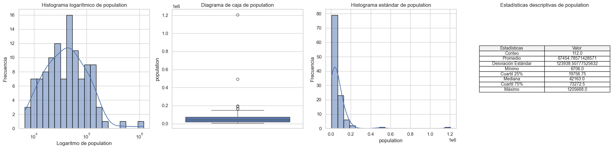
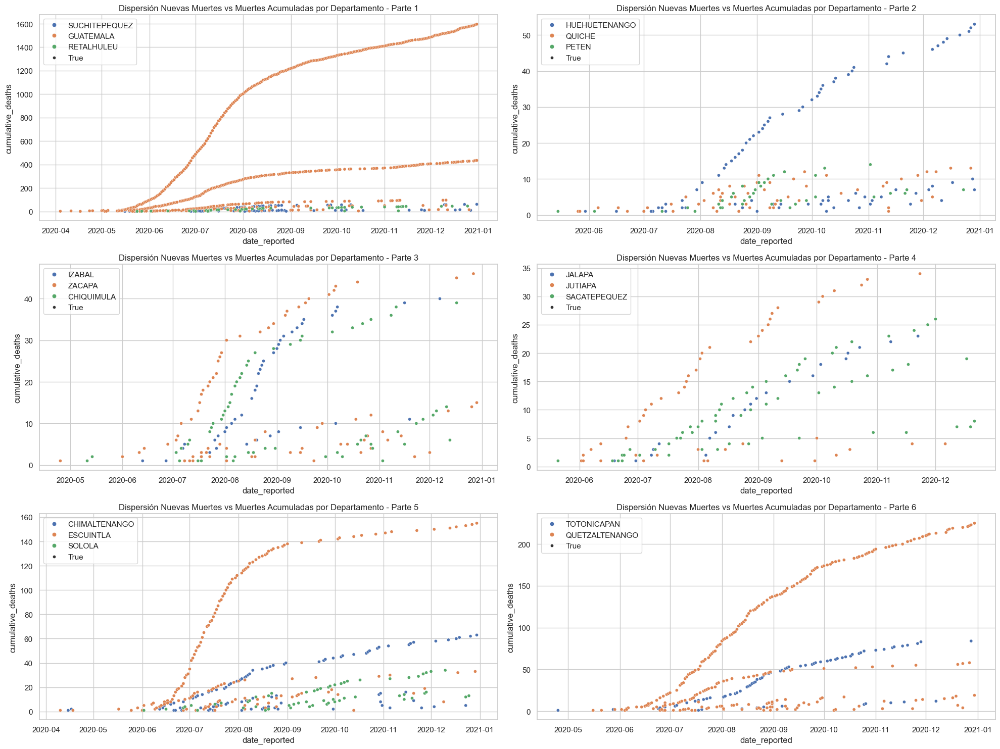
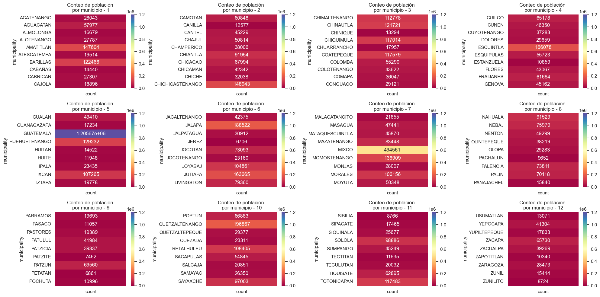
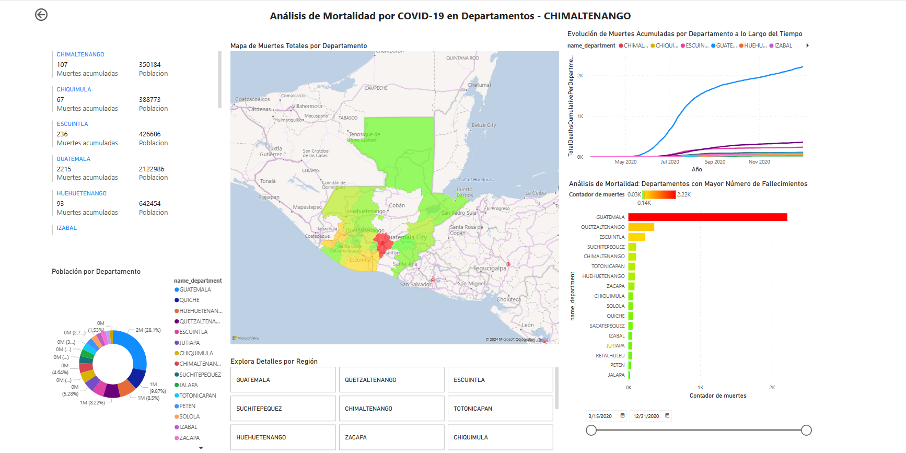

# University of San Carlos of Guatemala
## Faculty of Engineering
### Engineering in Computer Science and Systems.
##### Denilson Florentín de León Aguilar

This project was developed as part of the Seminar of Systems 2 course at the University of San Carlos of Guatemala, Faculty of Engineering, School of Computer Science and Systems. The project was carried out in three phases, each with specific objectives and detailed outcomes.

## Phase 1: Extraction, Transformation, and Loading (ETL) of Data

### Objectives
- Understand the ETL process and its importance in data science.
- Familiarize with different data sources and formats.
- Apply Python and Pandas knowledge for data processing.
- Apply data science concepts in a practical project.

### Activities Conducted
1. **Data Collection:**
   - Data was obtained from two main sources: deceased by municipality in Guatemala and a worldwide count of deaths and cases due to COVID-19.

2. **Data Processing:**
   - Data cleaning and transformation were performed using the Pandas library.
   - Steps included duplicate removal, format adjustments, handling null values, and standardization of fields.

3. **Data Model and Loading:**
   - A relational data model was designed.
   - Data was loaded into a SQL database using block transactions.

### Outcomes
- A consolidated dataset was generated with relevant information for analysis.
- The data model facilitated the organization and relationship of data on COVID-19 cases and deaths globally and in Guatemala.

## Phase 2: Exploratory Data Analysis (EDA)

### Objectives
- Understand the exploratory data analysis process.
- Apply Python, Pandas, and data visualization knowledge.
- Obtain insights and observations relevant for decision-making.

### Activities Conducted
1. **Mono Variable Analysis:**
   - Quantitative and qualitative data were analyzed, generating descriptive statistics and visualizations such as histograms and bar charts.

2. **Transformations and Multivariable EDA:**
   - Necessary transformations were made for multivariable analysis.
   - Scatter plots and bar charts, heat maps, and other visualizations were created to compare variables.

3. **Conclusions and Observations:**
   - Significant insights were obtained regarding the relationship between variables such as new deaths, population, and municipalities/departments.
### Outcomes
**Analysis of the `population` variable**
| **Logarithmic Histogram of `population`** | **Boxplot of `population`** | **Standard Histogram of `population`** |
| ------------------ | ------------------ | ------------- |
| The logarithmic histogram shows the distribution of municipality populations. Logarithmic transformation was applied to enhance visualization by eliminating zeros and adjusting scales. | The boxplot presents the variability and distribution of municipality populations. A wide range of population sizes is observed, with some municipalities having significantly higher outlier values. | The standard histogram displays the distribution of municipality populations without logarithmic transformation. Most municipalities have moderate populations, while some have exceptionally high population sizes. |

#### Cumulative Deaths by Department over Dates

#### **Municipalities vs Population**
**Analysis:**
The analysis of population by municipality reveals a total of 7,554,936 people distributed across various municipalities. The most populous municipality is GUATEMALA with a population of 1,205,668, followed by MIXCO with 494,561 people. In comparison, the least populous municipalities are SIBILIA, ZUNILITO, PATZITE, PETATAN, and JEREZ, with populations ranging from 8,766 to 6,706 people.

This analysis provides valuable insights into the distribution of the population in different municipalities. The concentration of population in GUATEMALA and other larger municipalities may have significant implications for planning and resource allocation.

**Municipalities Listing**

**Top 5:**
1. GUATEMALA: 1,205,668 people
2. MIXCO: 494,561 people
3. QUETZALTENANGO: 196,867 people
4. JALAPA: 188,522 people
5. ESCUINTLA: 166,078 people

**Bottom 5:**
1. SIBILIA: 8,766 people
2. ZUNILITO: 8,724 people
3. PATZITE: 7,462 people
4. PETATAN: 6,861 people
5. JEREZ: 6,706 people

###  Conclusions

1. **Population by Municipality and Department:**
   - The most populous municipality is **Guatemala** with a population of 1,205,668, while the most populous department is also **Guatemala** with 2,122,986 people.
   - Significant variability in population exists among municipalities and departments, emphasizing concentration in urban areas like Guatemala and Mixco.

2. **New Deaths and Cumulative Deaths:**
   - **Guatemala** (both at the department and municipality levels) exhibits the highest number of new deaths and cumulative deaths. This highlights the need for preventive measures and additional resources in this area.
   - Scatter plots of **New Deaths vs Cumulative Deaths** by municipality and department indicate a positive relationship, suggesting that places with more new deaths also tend to have more cumulative deaths.

3. **Geographical Distribution of New Deaths:**
   - Heatmap analysis reveals that municipalities like **Guatemala**, **Mixco**, and **Quetzaltenango** experience a significant number of new deaths. This underscores the need for specific strategies and attention in these areas.

4. **Cumulative Deaths:**
   - **Guatemala** leads in cumulative deaths at both the municipality and department levels, followed by **Mixco** and **Quetzaltenango**. This concentration emphasizes the importance of additional resources and efforts in these locations.

### Recommendations

1. **Resource Allocation:**
   - Prioritize resource allocation and medical attention in densely populated urban areas, especially in the department and municipality of **Guatemala**, to effectively manage the burden of new and cumulative deaths.

2. **Preventive Measures:**
   - Implement preventive measures and awareness campaigns in municipalities and departments with higher rates of new deaths, such as **Guatemala**, **Mixco**, and **Quetzaltenango**.

3. **Strategic Planning:**
   - Develop specific strategic plans to address disparities in the geographical distribution of cumulative deaths. This may include vaccination campaigns, additional healthcare resources, and mitigation measures.

4. **Continuous Monitoring:**
   - Establish a continuous monitoring system to assess the evolution of the situation in each municipality and department. This will allow for a rapid response and adjustments to strategies as needed.

5. **Interdepartmental Coordination:**
   - Foster coordination and collaboration between departments to share best practices, resources, and effective strategies. Information exchange will facilitate a more efficient and coordinated national response.

**NOTE:** These conclusions and recommendations are based on the analysis of provided data and aim to provide guidance for addressing specific challenges related to the COVID-19 pandemic in Guatemala. It is essential to adapt strategies to the evolving situation and consider the unique dynamics of each region.

## Phase 3: Power BI Analysis

### Objectives
- Understand the data visualization process with Power BI.
- Apply previous knowledge in a BI environment.
- Create effective dashboards for decision-making.

### Activities Conducted
1. **Power BI Project Setup:**
   - The project was structured in Power BI for the analysis of COVID-19 deaths and cases.

2. **Dashboard Development:**
   - Dashboards were created with detailed information on deaths by municipality, by department, and global data.

3. **Visual Elements and Comparisons:**
   - Different visual elements and data comparisons were used, including external data with the Ministry of Health of Guatemala.

### Outcomes
- Creation of interactive dashboards providing key information.
- Effective integration of external data and comparison with official sources.

Power BI Dashboard Online
- [Link to Power BI Dashboard](https://app.powerbi.com/view?r=eyJrIjoiNjZkNWFmMmItODc5Yi00YWE3LTgzYmEtY2JkZjA0MGExMDBkIiwidCI6IjIzYjVhMmVmLTM0OTYtNGEwYy04Y2ExLWI1ODM3OWI3YTQ0YyIsImMiOjR9)

**Power BI Dashboard: Dashboard - Departments of Guatemala**

## Overall Conclusions

This project comprehensively addressed the lifecycle of a data science project, from ETL to visualization using advanced tools like Power BI. The obtained results provide a deep understanding of the COVID-19 situation in Guatemala and globally, facilitating data-driven decision-making. Each phase significantly contributed to the development of practical skills in data science and critical information analysis.

### Specific Conclusions (Similar to Phase 2)
1. **Population by Municipality and Department:**
   - Demographic analysis highlights more populated municipalities and departments, such as GUATEMALA and MIXCO, influencing resource allocation strategies.

2. **New Deaths and Cumulative Deaths:**
   - Municipalities and departments with higher rates of new deaths, such as GUATEMALA, require preventive measures and additional resources.

3. **Geographical Distribution of New Deaths:**
   - The concentration of new deaths in municipalities like GUATEMALA, MIXCO, and QUETZALTENANGO underscores the need for specific strategies.

4. **Cumulative Deaths:**
   - GUATEMALA leads in cumulative deaths, emphasizing the importance of additional resources and strategic efforts in that area.

### Recommendations (Similar to Phase 2)
1. **Resource Allocation:**
   - Prioritize resource allocation and medical attention in densely populated urban areas, especially in the GUATEMALA department and municipality.

2. **Preventive Measures:**
   - Implement preventive measures and awareness campaigns in municipalities and departments with higher rates of new deaths, such as GUATEMALA, MIXCO, and QUETZALTENANGO.

3. **Strategic Planning:**
   - Develop specific strategic plans to address disparities in the geographical distribution of cumulative deaths. This may include vaccination campaigns, additional resources for the healthcare system, and mitigation measures.

4. **Continuous Monitoring:**
   - Establish a continuous monitoring system to assess the evolution of the situation in each municipality and department. This will allow for a rapid response and adjustments in strategies as needed.

5. **Interdepartmental Coordination:**
   - Foster coordination and collaboration between departments to share best practices, resources, and effective strategies. The exchange of information will facilitate a more efficient and coordinated national response.